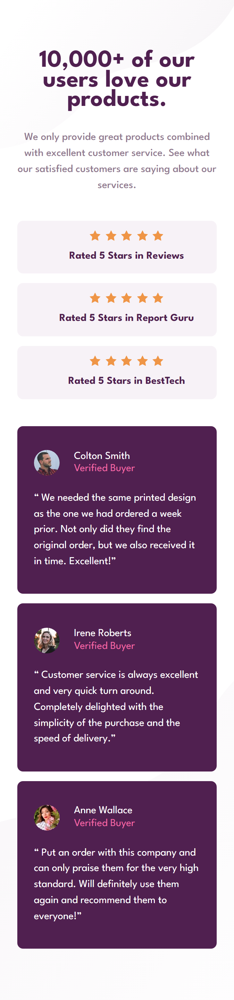
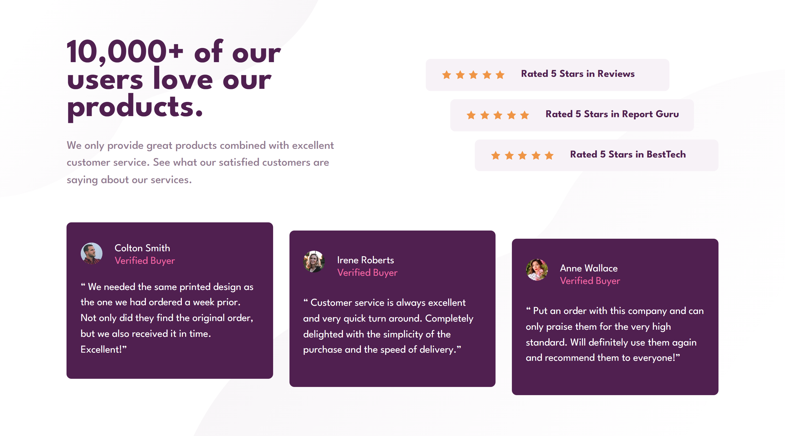

# Frontend Mentor - Social proof section solution

This is a solution to the [Social proof section challenge on Frontend Mentor](https://www.frontendmentor.io/challenges/social-proof-section-6e0qTv_bA). Frontend Mentor challenges help you improve your coding skills by building realistic projects. 

## Table of contents

- [Overview](#overview)
  - [The challenge](#the-challenge)
  - [Screenshot](#screenshot)
  - [Links](#links)
- [My process](#my-process)
  - [Built with](#built-with)
  - [What I learned](#what-i-learned)
  - [Continued development](#continued-development)
- [Author](#author)

## Overview

This is the third project in the **Buidling Reponsive Layouts Frontend Mentor Roadmap**.

Toughest challenge I had to do so far in Frontend Mentor. I tried my best to make it work across all screen sizes but I'm not sure I did a good job. I'm certainly not satisfied with the end result. but I think I spent quite the time on it. and I'd like to move on.

It was a great practice for CSS Grid and Flexbox. as the layout changes drastically on the desktop version. However the real headache was in managing how the spacing and font size scale based on the viewport dimensions / user preferences.

### The challenge

Users should be able to:

- View the optimal layout for the section depending on their device's screen size

### Screenshot

#### Mobile

#### Desktop

### Links

- Solution URL: [Solution URL](https://www.frontendmentor.io/solutions/responsive-social-proof-section-NBvr1Vvubq)
- Live Site URL: [Live Site URL](https://frontendmentor-ilyesab.github.io/social-proof-section/)

## My process

### Built with

- Semantic HTML5 markup
- CSS custom properties
- Flexbox
- CSS Grid
- Mobile-first workflow

### What I learned

I used `grid-template-areas` to define the layout in mobile and desktop. making it easy to see in the CSS how the different elements are structured on the page.

I also attempted to use `clamp` for a responsive `font-size` for the main heading and the paragraph below it.

### Continued development

I'd like to use `clamp` more I tried to implement it at the end of the project and did a couple of trial and errors with different values.

I think it's a neat function to use to handle the responsiveness of typography in a readable / short manner. I'd like to continue practice using it.

## Author

- Frontend Mentor - [@ilyesab](https://www.frontendmentor.io/profile/ilyesab)

